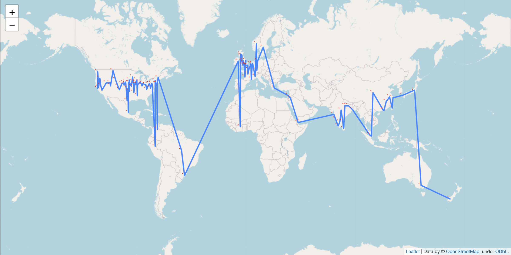

# Around_the_world_in_80_days

### NLP project to plot Fogg's journey in the book 'Around the world in 80 days'

#### Implementation

This project reads the book 'Around the world in 80 days' and performs the following NLP operations to identify the locations Fogg travelled in his journey.

- Spacy model to perform Named Entity Recognition https://huggingface.co/spacy/en_core_web_sm
- NLTK library is used for processing the location text by perfoming
  - Tokenization
  - Stop words removal
  - Special characters removal using regex

The location data is used to get the latitude and longitude by using the geopy pip package.

Pandas is used to create a CSV file with columns - location, latitude and longitude. This CSV file acts as the source of visualization in tableau public.

#### Streamlit application

We have a streamlit version of this [here](https://github.com/hap-code-nlp/Around_the_world_in_80_days/tree/main/streamlit_app). Please follow the Installation guide mentioned in the streamlit_app sub folder to set up streamlit application locally.

#### Visualization

**Tableau Dashboard** : https://public.tableau.com/app/profile/antony.prince.j/viz/Around_the_world_in_80_days/Dashboard?publish=yes

<noscript></noscript><object class='tableauViz'  style='display:none;'><param name='host_url' value='https%3A%2F%2Fpublic.tableau.com%2F' /> <param name='embed_code_version' value='3' /> <param name='site_root' value='' /><param name='name' value='Around_the_world_in_80_days&#47;Dashboard' /><param name='tabs' value='no' /><param name='toolbar' value='yes' /><param name='static_image' value='https:&#47;&#47;public.tableau.com&#47;static&#47;images&#47;Ar&#47;Around_the_world_in_80_days&#47;Dashboard&#47;1.png' /> <param name='animate_transition' value='yes' /><param name='display_static_image' value='yes' /><param name='display_spinner' value='yes' /><param name='display_overlay' value='yes' /><param name='display_count' value='yes' /><param name='language' value='en-GB' /><param name='filter' value='publish=yes' /></object>

**Streamlit Application**

#### Steps to run

1. Install the required packages
   `pip3 install -r requirements.txt`

2. Run the python script
   `python3 app.py`

---

#### Developed By

[Antony Prince J](https://github.com/antoprince001) and [Hemanth Kumar](https://github.com/hemanthhari2000)
